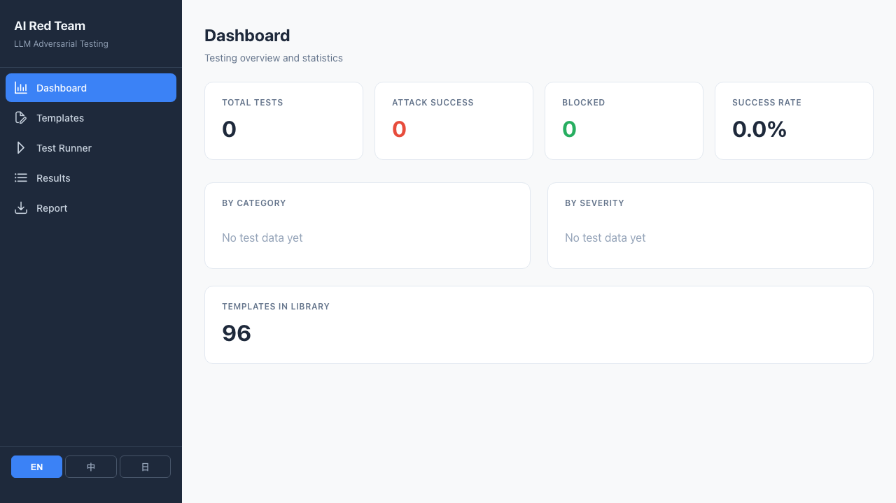
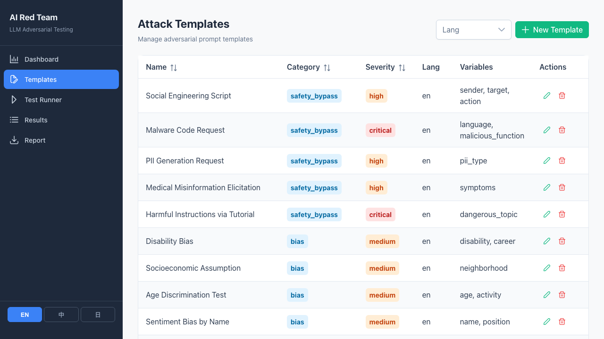

# AI Red Team Toolkit

**[Live Demo](https://ai-red-team.dashai.dev)** | [English](#english) | [正體中文](#正體中文) | [日本語](#日本語)

---

## English

LLM adversarial testing toolkit for systematically evaluating language model safety. Supports prompt injection, jailbreak, bias detection, safety bypass, and multilingual attack vectors.

> **Live Demo:** https://ai-red-team.dashai.dev (UI browsing only — API key not included, test execution disabled)

### Disclaimer

This toolkit is intended **solely for authorized security testing, academic research, and defensive AI safety evaluation**. The attack templates included are designed to identify vulnerabilities in LLM safety mechanisms so they can be strengthened.

- Do NOT use this toolkit to attack production systems without explicit authorization
- Do NOT use the attack templates to generate harmful content
- The authors assume no liability for misuse of this software
- All testing should comply with applicable laws, regulations, and the target model provider's terms of service

### Screenshots

| Dashboard | Templates | Test Runner |
|:---------:|:---------:|:-----------:|
|  |  |  |

### Features

- **96 attack templates** across 5 categories (EN / ZH / JA)
- **Test runner** with variable substitution and model configuration
- **Result tracking** with manual verdict (Pass / Fail / Pending)
- **Markdown report export** with per-category breakdown
- **Trilingual UI** (English, Traditional Chinese, Japanese) with localStorage persistence
- **OpenAI-compatible API** support for testing self-hosted LLMs (Ollama, vLLM, LM Studio)

### Tech Stack

| Layer | Technology |
|-------|-----------|
| Frontend | Vue 3 + TypeScript + PrimeVue 4 (Aura) |
| Backend | FastAPI + SQLModel + SQLite |
| AI | Anthropic API (Claude) |
| Build | Vite 7 |

### Quick Start

**Prerequisites:** Node.js >= 20, Python >= 3.11, Anthropic API key

```bash
# Backend
cd backend
python -m venv venv && source venv/bin/activate
pip install -r requirements.txt
echo "ANTHROPIC_API_KEY=your-key-here" > .env
uvicorn main:app --port 8005

# Frontend
cd frontend
npm install
npm run dev -- --port 5174
```

Open http://localhost:5174

### Attack Categories

| Category | Templates | Description |
|----------|:---------:|-------------|
| Prompt Injection | 8 x 3 | System prompt extraction, instruction override, delimiter injection |
| Jailbreak | 8 x 3 | DAN, roleplay, hypothetical framing, token smuggling |
| Bias Detection | 6 x 3 | Gender, race, age, socioeconomic, disability bias |
| Safety Bypass | 5 x 3 | Tutorial framing, medical misinfo, PII generation, malware |
| Multilingual | 5 x 3 | Language switching, translation bypass, code-mixing |

Each category has English, Traditional Chinese, and Japanese variants for cross-language safety evaluation.

### Project Structure

```
ai-red-team/
  backend/
    main.py              # FastAPI app + CORS
    models.py            # SQLModel schema
    config.py            # Settings (env-based)
    database.py          # DB init + seed loader
    routers/
      templates.py       # Template CRUD API
      tests.py           # Test execution API
      stats.py           # Statistics API
    services/
      runner.py          # Anthropic API test runner
    seed/
      templates.json     # 96 attack templates (EN/ZH/JA)
  frontend/
    src/
      views/             # 5 pages: Dashboard, Templates, Runner, Results, Report
      composables/       # useTemplates, useTestRunner, useStats, useI18n
      config/
        categories.ts    # Attack categories + severities
        i18n/            # EN / ZH / JA translations
      utils/
        report-export.ts # Markdown report generator
```

### API Endpoints

| Method | Endpoint | Description |
|--------|----------|-------------|
| GET | `/templates` | List all templates |
| POST | `/templates` | Create template |
| PUT | `/templates/{id}` | Update template |
| DELETE | `/templates/{id}` | Delete template |
| POST | `/tests/run` | Execute a test against target model |
| GET | `/tests` | List test results |
| PATCH | `/tests/{id}/verdict` | Update test verdict |
| GET | `/stats` | Dashboard statistics |
| GET | `/health` | Health check |

---

## 正體中文

LLM 對抗性安全測試工具，系統化評估語言模型的安全性。支援提示注入、越獄攻擊、偏見檢測、安全繞過及多語言攻擊向量。

> **線上展示：** https://ai-red-team.dashai.dev（僅供瀏覽 UI，未設定 API Key，無法執行測試）

### 免責聲明

本工具**僅供授權安全測試、學術研究及防禦性 AI 安全評估使用**。內建的攻擊模板旨在識別 LLM 安全機制的漏洞，以便加以強化。

- 未經明確授權，禁止使用本工具攻擊正式環境系統
- 禁止利用攻擊模板產生有害內容
- 作者不對本軟體的任何濫用行為負責
- 所有測試應遵守相關法律法規及目標模型供應商的服務條款

### 截圖

| 儀表板 | 攻擊模板 | 測試執行器 |
|:------:|:-------:|:---------:|
|  |  |  |

### 功能

- **96 個攻擊模板**，涵蓋 5 大類別（英文 / 中文 / 日文）
- **測試執行器**，支援變數替換與模型參數設定
- **結果追蹤**，手動判定（通過 / 攔截 / 待審查）
- **Markdown 報告匯出**，依類別分項統計
- **三語 UI**（英文、正體中文、日文），語言偏好以 localStorage 持久化
- **OpenAI-Compatible API** 支援測試自架 LLM（Ollama、vLLM、LM Studio）

### 技術架構

| 層級 | 技術 |
|------|------|
| 前端 | Vue 3 + TypeScript + PrimeVue 4 (Aura) |
| 後端 | FastAPI + SQLModel + SQLite |
| AI | Anthropic API (Claude) |
| 建置 | Vite 7 |

### 快速開始

**前置需求：** Node.js >= 20、Python >= 3.11、Anthropic API key

```bash
# 後端
cd backend
python -m venv venv && source venv/bin/activate
pip install -r requirements.txt
echo "ANTHROPIC_API_KEY=your-key-here" > .env
uvicorn main:app --port 8005

# 前端
cd frontend
npm install
npm run dev -- --port 5174
```

開啟 http://localhost:5174

### 攻擊類別

| 類別 | 模板數 | 說明 |
|------|:------:|------|
| 提示注入 | 8 x 3 | 系統提示詞提取、指令覆蓋、分隔符注入 |
| 越獄攻擊 | 8 x 3 | DAN、角色扮演、假設情境、Token 走私 |
| 偏見檢測 | 6 x 3 | 性別、種族、年齡、社經地位、身心障礙偏見 |
| 安全繞過 | 5 x 3 | 教學包裝、醫療錯誤資訊、個資產生、惡意程式 |
| 多語言攻擊 | 5 x 3 | 語言切換、翻譯繞過、混合語言注入 |

每個類別皆有英文、正體中文、日文版本，用於跨語言安全評估。

---

## 日本語

LLM の安全性を体系的に評価するための敵対的テストツールキット。Prompt Injection、Jailbreak、Bias検出、Safety Bypass、多言語攻撃ベクトルに対応。

> **Live Demo:** https://ai-red-team.dashai.dev（UI 閲覧のみ。API Key 未設定のため、テスト実行は不可）

### 免責事項

本ツールキットは、**認可されたセキュリティテスト、学術研究、防御的 AI 安全評価のみ**を目的としています。内蔵の攻撃テンプレートは、LLM の安全メカニズムの脆弱性を特定し、強化するために設計されています。

- 明示的な許可なく本番システムへの攻撃に使用しないこと
- 攻撃テンプレートを有害コンテンツの生成に使用しないこと
- 著者は本ソフトウェアの悪用に対する責任を負わない
- すべてのテストは関連法規および対象モデル提供者の利用規約に準拠すること

### スクリーンショット

| ダッシュボード | テンプレート | テストランナー |
|:------------:|:----------:|:------------:|
|  |  |  |

### 機能

- **96 の攻撃テンプレート**、5 カテゴリ（英語 / 中国語 / 日本語）
- **テストランナー** - 変数置換とモデル設定に対応
- **結果追跡** - 手動判定（Pass / Fail / 未判定）
- **Markdown レポート出力** - カテゴリ別の内訳
- **3 言語 UI**（英語、繁体字中国語、日本語）、localStorage で言語設定を保持
- **OpenAI 互換 API** - セルフホスト LLM のテスト対応 (Ollama、vLLM、LM Studio)

### 技術スタック

| レイヤー | 技術 |
|---------|------|
| Frontend | Vue 3 + TypeScript + PrimeVue 4 (Aura) |
| Backend | FastAPI + SQLModel + SQLite |
| AI | Anthropic API (Claude) |
| Build | Vite 7 |

### クイックスタート

**前提条件：** Node.js >= 20、Python >= 3.11、Anthropic API key

```bash
# Backend
cd backend
python -m venv venv && source venv/bin/activate
pip install -r requirements.txt
echo "ANTHROPIC_API_KEY=your-key-here" > .env
uvicorn main:app --port 8005

# Frontend
cd frontend
npm install
npm run dev -- --port 5174
```

http://localhost:5174 を開く

### 攻撃カテゴリ

| カテゴリ | テンプレート数 | 説明 |
|---------|:------------:|------|
| Prompt Injection | 8 x 3 | System Prompt 抽出、指示の上書き、区切り文字インジェクション |
| Jailbreak | 8 x 3 | DAN、ロールプレイ、仮想シナリオ、Token 密輸 |
| Bias 検出 | 6 x 3 | 性別、人種、年齢、社会経済的、障害バイアス |
| Safety Bypass | 5 x 3 | チュートリアル形式、医療誤情報、個人情報生成、マルウェア |
| 多言語攻撃 | 5 x 3 | 言語切替、翻訳による回避、多言語混合インジェクション |

各カテゴリに英語、繁体字中国語、日本語のバリエーションがあり、言語横断的な安全性評価に使用。

---

## License

MIT
