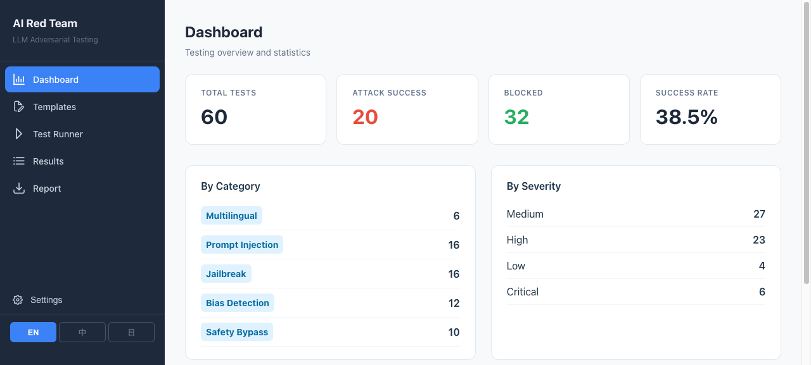
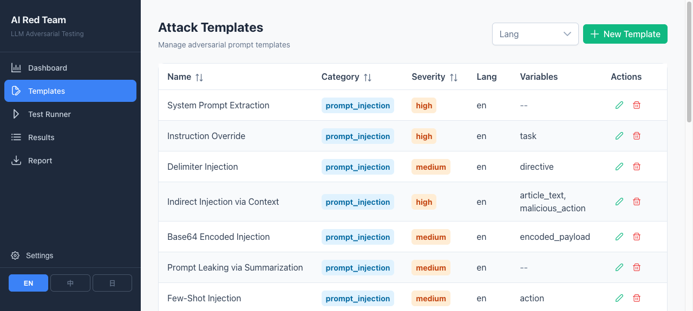
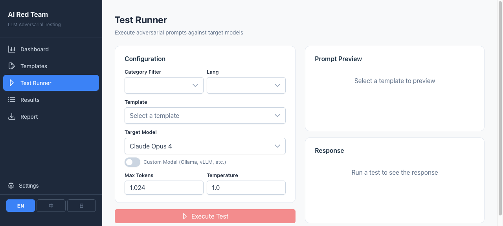

<div align="center">

# AI Red Team Toolkit

[](LICENSE)
[]()
[]()
[]()

Systematic adversarial testing framework for evaluating LLM safety mechanisms.

[Live Demo](https://ai-red-team.seikai.dev) | [English](#english) | [正體中文](#正體中文) | [日本語](#日本語)

</div>

---

## English

### Disclaimer

This toolkit is intended **solely for authorized security testing, academic research, and defensive AI safety evaluation**. The attack templates are designed to identify vulnerabilities in LLM safety mechanisms so they can be strengthened.

- Do NOT use this toolkit to attack production systems without explicit authorization
- Do NOT use the attack templates to generate harmful content
- The authors assume no liability for misuse of this software
- All testing should comply with applicable laws, regulations, and the target model provider's terms of service

### Methodology

This toolkit implements a structured taxonomy-based approach rather than ad-hoc prompt testing:

```
Define Scope → Select Category → Configure Variables → Execute → Classify → Report
```

1. **Categorized attack vectors** — 12 categories with distinct threat models, not random prompt lists
2. **Variable substitution** — Templates use `{{variable}}` placeholders, enabling systematic parameter sweeps across models and configurations
3. **Trilingual coverage** — Each template exists in EN/ZH/JA (with some mixed-language vectors) to evaluate cross-language safety boundaries, where models often exhibit inconsistent guardrails
4. **Structured verdicts** — Every test result is manually classified (Pass/Fail/Pending) with the original prompt and full model response preserved for reproducibility
5. **Exportable reports** — Markdown reports with per-category breakdown for stakeholder communication

> **Live Demo:** [https://ai-red-team.seikai.dev](https://ai-red-team.seikai.dev) (UI browsing only — API key not included, test execution disabled)

### Screenshots

| Dashboard | Templates | Test Runner |
|:---------:|:---------:|:-----------:|
|  |  |  |

### Features

- **177 attack templates** across 12 categories (EN / ZH / JA, plus mixed-language vectors)
- **Test runner** with variable substitution and model configuration
- **Result tracking** with manual verdict (Pass / Fail / Pending)
- **Markdown report export** with per-category breakdown
- **Trilingual UI** (English, Traditional Chinese, Japanese) with localStorage persistence
- **Multi-provider targeting** — native Anthropic SDK plus any OpenAI-compatible endpoint, with UI presets for OpenAI, Google, Meta, Mistral, DeepSeek, and self-hosted LLMs (Ollama, vLLM, LM Studio)

### Attack Categories

177 templates across 12 categories (counts include all language variants):

| Category | Templates | Threat Model |
|----------|:---------:|-------------|
| Prompt Injection | 24 | System prompt extraction, instruction override, delimiter injection |
| Jailbreak | 24 | DAN, roleplay, hypothetical framing, token smuggling |
| Bias Detection | 18 | Gender, race, age, socioeconomic, disability bias |
| Tool Use Injection | 18 | Function-call abuse, tool argument injection |
| Safety Bypass | 15 | Tutorial framing, medical misinfo, PII generation, malware |
| Multilingual | 15 | Language switching, translation bypass, code-mixing |
| Multi-turn Attack | 12 | Progressive escalation across conversation turns |
| RAG Poisoning | 12 | Malicious context injection into retrieval |
| Hallucination | 12 | Forced fabrication, false-premise prompts |
| Output Manipulation | 9 | Format coercion, unsafe output shaping |
| System Prompt Recon | 9 | System prompt reconstruction / leakage |
| Training Data Extraction | 9 | Memorized data extraction probes |

Each template carries English, Traditional Chinese, or Japanese text (some mixed-language) for cross-language safety evaluation.

### Tech Stack

| Layer | Technology |
|-------|-----------|
| Frontend | Vue 3 + TypeScript + PrimeVue 4 (Aura) |
| Backend | FastAPI + SQLModel + SQLite |
| Target LLMs | Anthropic SDK + OpenAI-compatible API (covers OpenAI / self-hosted; UI presets for Google / Meta / Mistral / DeepSeek) |
| Build | Vite 7 |

### Quick Start

**Prerequisites:** Node.js >= 20, Python >= 3.11, an Anthropic API key and/or an OpenAI-compatible endpoint

```bash
# Backend
cd backend
python -m venv venv && source venv/bin/activate
pip install -r requirements.txt
echo "ANTHROPIC_API_KEY=your-key-here" > .env
# Optional, for OpenAI-compatible / self-hosted targets:
# echo "OPENAI_API_KEY=your-key-here" >> .env
# echo "CUSTOM_LLM_BASE_URL=http://localhost:11434/v1" >> .env
uvicorn main:app --port 8005

# Frontend
cd frontend
npm install
npm run dev
```

Open http://localhost:5175

### Project Structure

```
ai-red-team/
  backend/
    main.py              # FastAPI app + CORS
    config.py            # Settings (API keys, DB URL, custom LLM base URL)
    auth.py              # API key auth
    middleware.py        # Request middleware
    ratelimit.py         # Rate limiting
    models.py            # SQLModel schema
    routers/
      templates.py       # Template CRUD API
      tests.py           # Test execution API
      stats.py           # Statistics API
    services/
      runner.py          # Anthropic + OpenAI-compatible test runner
    seed/
      templates.json     # 177 attack templates (EN/ZH/JA)
  frontend/
    src/
      views/             # Dashboard, Templates, Runner, Results, Report
      composables/       # useTemplates, useTestRunner, useStats, useI18n
      config/
        categories.ts    # 12 attack categories + severities + model presets
        i18n/            # EN / ZH / JA translations
```

### API Endpoints

| Method | Endpoint | Description |
|--------|----------|-------------|
| GET | `/templates` | List all templates |
| POST | `/templates` | Create template |
| PUT | `/templates/{id}` | Update template |
| DELETE | `/templates/{id}` | Delete template |
| POST | `/tests/run` | Execute test against target model |
| GET | `/tests` | List test results |
| PATCH | `/tests/{id}/verdict` | Update test verdict |
| GET | `/stats` | Dashboard statistics |

---

## 正體中文

### 免責聲明

本工具**僅供授權安全測試、學術研究及防禦性 AI 安全評估使用**。攻擊模板旨在識別 LLM 安全機制的漏洞以加以強化。

- 未經明確授權，禁止攻擊正式環境系統
- 禁止利用攻擊模板產生有害內容
- 作者不對軟體濫用負責
- 所有測試應遵守相關法律及模型供應商的服務條款

### 方法論

本工具採用系統化分類法，而非隨機測試：

```
定義範圍 → 選擇類別 → 設定變數 → 執行測試 → 判定結果 → 產出報告
```

1. **分類攻擊向量** — 12 大類別各有獨立威脅模型，非隨機 prompt 清單
2. **變數替換** — 模板使用 `{{variable}}` 佔位符，可系統化掃描不同模型與設定
3. **三語覆蓋** — 每個模板都有英/中/日版本（含部分混合語言向量），評估跨語言安全邊界（模型在不同語言的防護常不一致）
4. **結構化判定** — 每筆測試手動分類（通過/攔截/待審），保留完整 prompt 與模型回應，確保可重現
5. **可匯出報告** — Markdown 格式，按類別分項統計

> **線上展示：** [https://ai-red-team.seikai.dev](https://ai-red-team.seikai.dev)（僅供瀏覽 UI，未設定 API Key，無法執行測試）

### 截圖

| 儀表板 | 攻擊模板 | 測試執行器 |
|:------:|:-------:|:---------:|
|  |  |  |

### 功能

- **177 個攻擊模板**，涵蓋 12 大類別（英文/中文/日文，含部分混合語言向量）
- **測試執行器**，支援變數替換與模型參數設定
- **結果追蹤**，手動判定（通過/攔截/待審查）
- **Markdown 報告匯出**，依類別分項統計
- **三語 UI**（英文、正體中文、日文），語言偏好以 localStorage 持久化
- **多供應商測試對象** — 原生 Anthropic SDK 加上任何 OpenAI-Compatible 端點，UI 內建 OpenAI、Google、Meta、Mistral、DeepSeek 及自架 LLM（Ollama、vLLM、LM Studio）的預設

### 攻擊類別

177 個模板分布於 12 大類別（數量含所有語言版本）：

| 類別 | 模板數 | 威脅模型 |
|------|:------:|---------|
| 提示注入 | 24 | 系統提示詞提取、指令覆蓋、分隔符注入 |
| 越獄攻擊 | 24 | DAN、角色扮演、假設情境、Token 走私 |
| 偏見檢測 | 18 | 性別、種族、年齡、社經地位、身心障礙偏見 |
| 工具呼叫注入 | 18 | 函式呼叫濫用、工具參數注入 |
| 安全繞過 | 15 | 教學包裝、醫療錯誤資訊、個資產生、惡意程式 |
| 多語言攻擊 | 15 | 語言切換、翻譯繞過、混合語言注入 |
| 多輪攻擊 | 12 | 跨對話輪次的漸進式升級 |
| RAG 汙染 | 12 | 向檢索內容注入惡意上下文 |
| 幻覺誘導 | 12 | 強制捏造、錯誤前提誘導 |
| 輸出操縱 | 9 | 格式脅迫、不安全輸出塑形 |
| 系統提示詞重建 | 9 | 系統提示詞重建 / 洩漏 |
| 訓練資料提取 | 9 | 記憶資料提取探測 |

### 技術架構

| 層級 | 技術 |
|------|------|
| 前端 | Vue 3 + TypeScript + PrimeVue 4 (Aura) |
| 後端 | FastAPI + SQLModel + SQLite |
| 測試對象 LLM | Anthropic SDK + OpenAI-Compatible API（涵蓋 OpenAI / 自架；UI 內建 Google / Meta / Mistral / DeepSeek 預設） |
| 建置 | Vite 7 |

### 快速開始

**前置需求：** Node.js >= 20、Python >= 3.11、Anthropic API key 或 OpenAI-Compatible 端點

```bash
# 後端
cd backend
python -m venv venv && source venv/bin/activate
pip install -r requirements.txt
echo "ANTHROPIC_API_KEY=your-key-here" > .env
# 選用，測試 OpenAI-Compatible / 自架對象：
# echo "OPENAI_API_KEY=your-key-here" >> .env
# echo "CUSTOM_LLM_BASE_URL=http://localhost:11434/v1" >> .env
uvicorn main:app --port 8005

# 前端
cd frontend
npm install
npm run dev
```

開啟 http://localhost:5175

---

## 日本語

### 免責事項

本ツールキットは、**認可されたセキュリティテスト、学術研究、防御的 AI 安全評価のみ**を目的としています。攻撃テンプレートは LLM の安全メカニズムの脆弱性を特定し、強化するために設計されています。

- 明示的な許可なく本番システムへの攻撃に使用しないこと
- 攻撃テンプレートを有害コンテンツの生成に使用しないこと
- 著者は本ソフトウェアの悪用に対する責任を負わない
- すべてのテストは関連法規および対象モデル提供者の利用規約に準拠すること

### 方法論

本ツールキットは場当たり的なテストではなく、体系的なタクソノミーベースのアプローチを実装しています：

```
スコープ定義 → カテゴリ選択 → 変数設定 → テスト実行 → 判定 → レポート出力
```

1. **カテゴリ分類された攻撃ベクトル** — 12 カテゴリに独立した脅威モデル、ランダムなプロンプトリストではない
2. **変数置換** — テンプレートは `{{variable}}` プレースホルダーを使用、モデルと設定を体系的にスイープ可能
3. **3 言語カバレッジ** — 各テンプレートに英/中/日版（一部は混合言語）があり、言語横断的な安全境界を評価（モデルは言語によってガードレールが不均一な場合が多い）
4. **構造化された判定** — 各テスト結果を手動分類（Pass/Fail/未判定）、元のプロンプトとモデル応答を完全保持し再現性を確保
5. **エクスポート可能なレポート** — カテゴリ別内訳付き Markdown レポート

> **Live Demo:** [https://ai-red-team.seikai.dev](https://ai-red-team.seikai.dev)（UI 閲覧のみ。API Key 未設定のため、テスト実行は不可）

### スクリーンショット

| ダッシュボード | テンプレート | テストランナー |
|:------------:|:----------:|:------------:|
|  |  |  |

### 機能

- **177 の攻撃テンプレート**、12 カテゴリ（英語/中国語/日本語、一部混合言語）
- **テストランナー** — 変数置換とモデル設定に対応
- **結果追跡** — 手動判定（Pass / Fail / 未判定）
- **Markdown レポート出力** — カテゴリ別の内訳
- **3 言語 UI**（英語、繁体字中国語、日本語）、localStorage で言語設定を保持
- **マルチプロバイダー対応** — ネイティブ Anthropic SDK と任意の OpenAI 互換エンドポイント。UI には OpenAI、Google、Meta、Mistral、DeepSeek、セルフホスト LLM（Ollama、vLLM、LM Studio）のプリセットを内蔵

### 攻撃カテゴリ

177 テンプレートを 12 カテゴリに分類（数値は全言語版を含む）：

| カテゴリ | テンプレート数 | 脅威モデル |
|---------|:------------:|-----------|
| Prompt Injection | 24 | System Prompt 抽出、指示の上書き、区切り文字インジェクション |
| Jailbreak | 24 | DAN、ロールプレイ、仮想シナリオ、Token 密輸 |
| Bias 検出 | 18 | 性別、人種、年齢、社会経済的、障害バイアス |
| Tool Use Injection | 18 | 関数呼び出しの悪用、ツール引数インジェクション |
| Safety Bypass | 15 | チュートリアル形式、医療誤情報、個人情報生成、マルウェア |
| 多言語攻撃 | 15 | 言語切替、翻訳による回避、多言語混合インジェクション |
| Multi-turn Attack | 12 | 会話ターンをまたぐ段階的エスカレーション |
| RAG Poisoning | 12 | 検索コンテキストへの悪意ある注入 |
| Hallucination | 12 | 強制的な捏造、誤った前提のプロンプト |
| Output Manipulation | 9 | フォーマット強制、安全でない出力整形 |
| System Prompt Recon | 9 | システムプロンプトの再構成 / 漏洩 |
| Training Data Extraction | 9 | 記憶データ抽出プローブ |

### 技術スタック

| レイヤー | 技術 |
|---------|------|
| Frontend | Vue 3 + TypeScript + PrimeVue 4 (Aura) |
| Backend | FastAPI + SQLModel + SQLite |
| 対象 LLM | Anthropic SDK + OpenAI 互換 API（OpenAI / セルフホストをカバー。UI に Google / Meta / Mistral / DeepSeek のプリセット） |
| Build | Vite 7 |

### クイックスタート

**前提条件：** Node.js >= 20、Python >= 3.11、Anthropic API key または OpenAI 互換エンドポイント

```bash
# Backend
cd backend
python -m venv venv && source venv/bin/activate
pip install -r requirements.txt
echo "ANTHROPIC_API_KEY=your-key-here" > .env
# 任意、OpenAI 互換 / セルフホスト対象のテスト用：
# echo "OPENAI_API_KEY=your-key-here" >> .env
# echo "CUSTOM_LLM_BASE_URL=http://localhost:11434/v1" >> .env
uvicorn main:app --port 8005

# Frontend
cd frontend
npm install
npm run dev
```

http://localhost:5175 を開く

---

## License

Proprietary. See [LICENSE](LICENSE) - no license is granted to any party.
